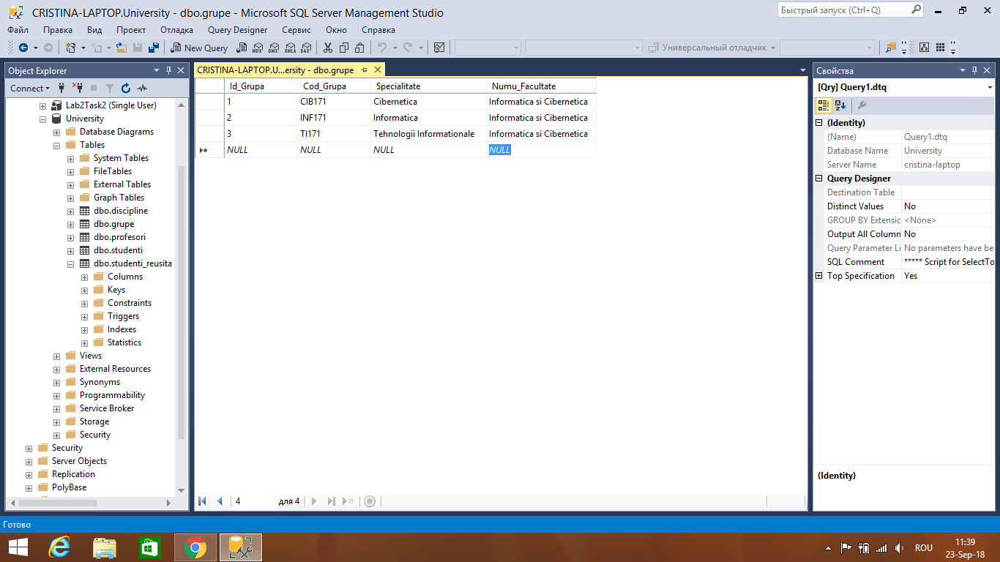
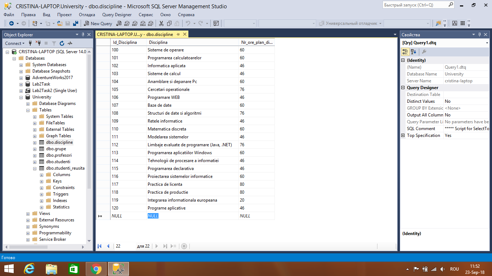

# Database Laboratory Work #3
### Answers to the questions:
#### 1. a)16,2 b)116,2
#### 2. Specialy for this table to store the result of Col\*Col2 expresion, the data type for Col3 is DECIMAL(2.1)
### Results of the Laboratory Work:

