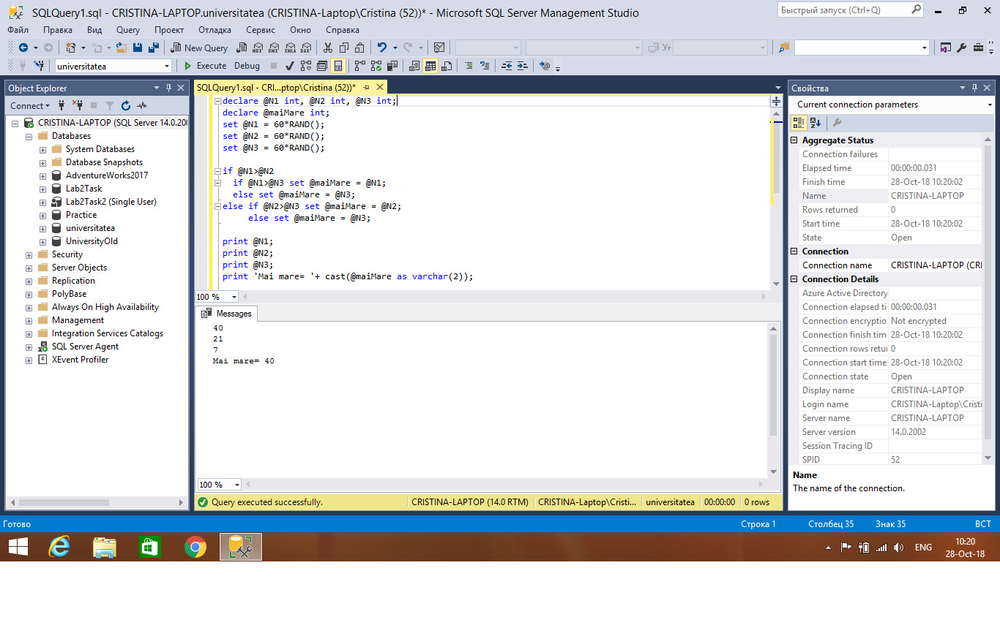
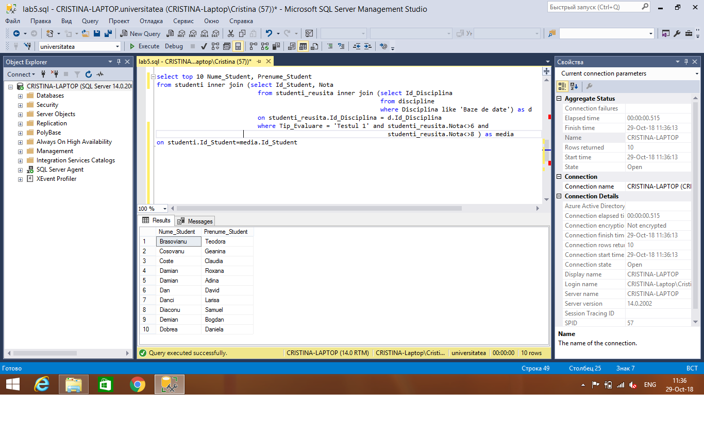
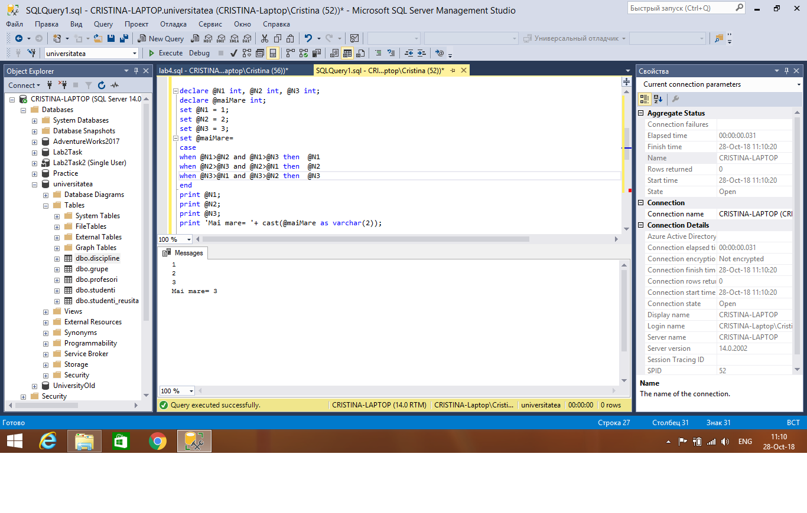
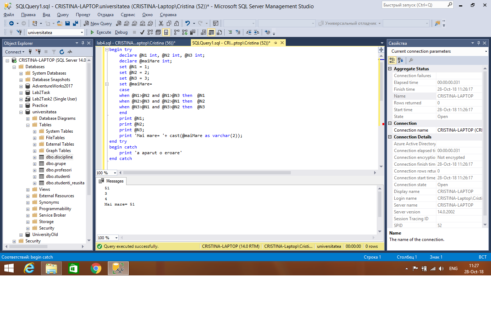
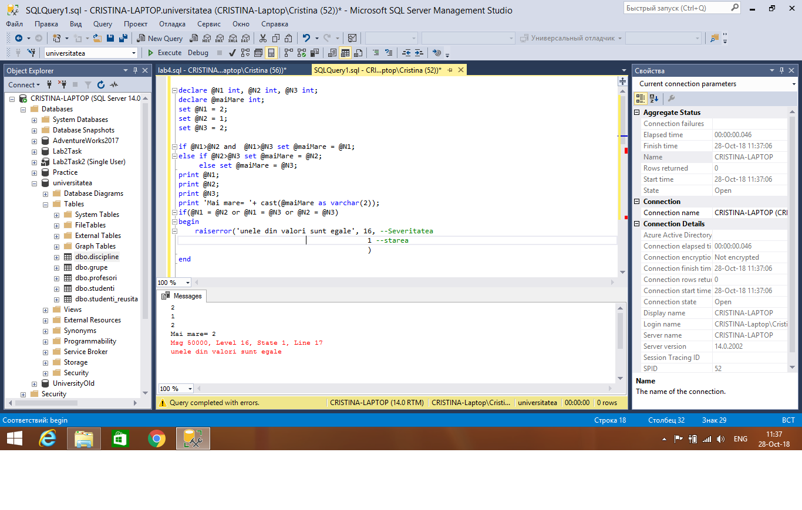
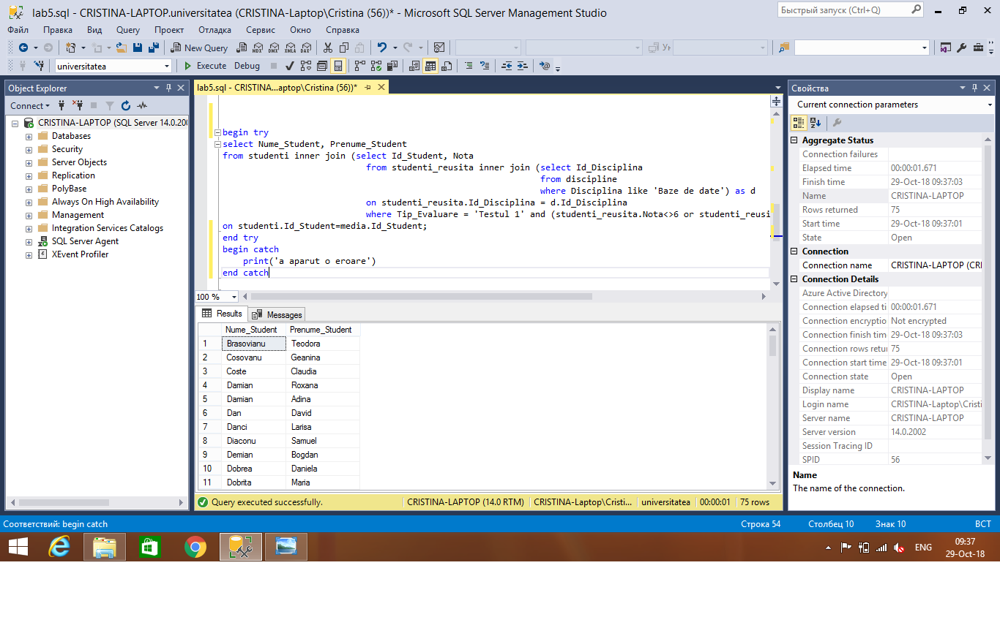
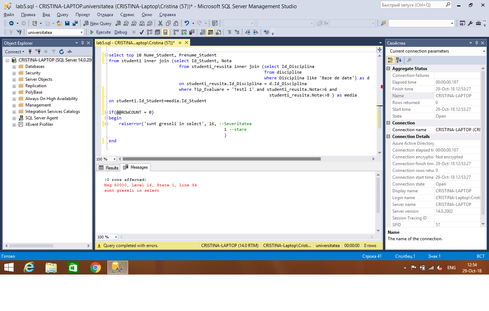

# Database Laboratory Work #5
### Results of the Laboratory Work:
### Exercise N1(if else):

### Exercise N2:
### Select first 10 students who wrote 'Testul 1' at 'Baze de date' except the marks 6 and 8

### Exercise N3(case for ex1):

### Exercise N4:
### For ex1:
### Try...Catch:

### Raiserror:

### For ex2:
### Try...Catch:

### Raiserror:

