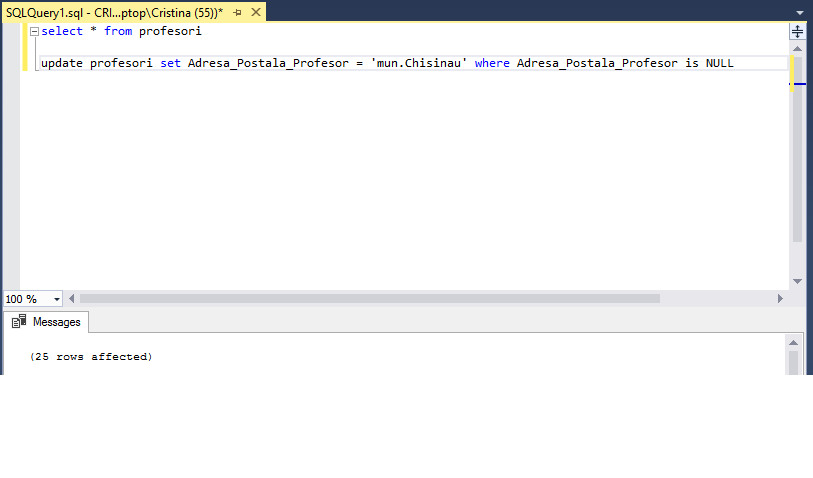
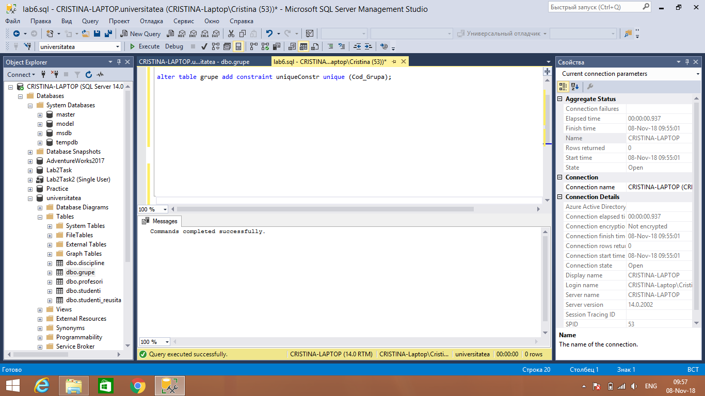
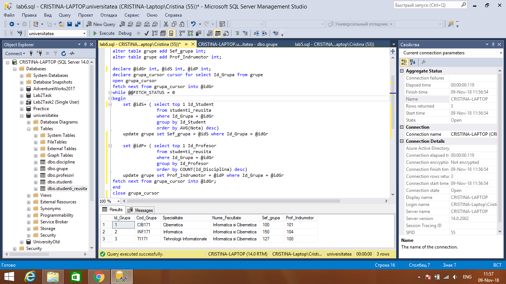
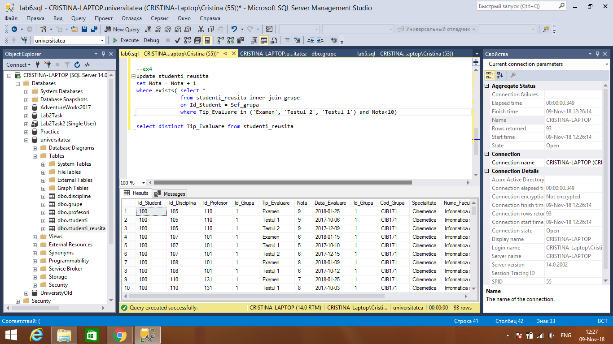
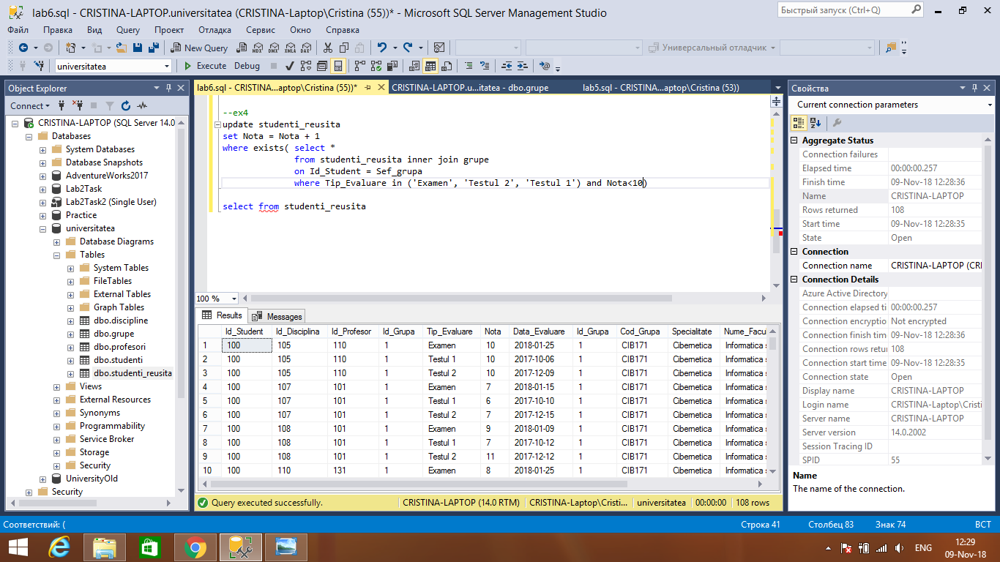
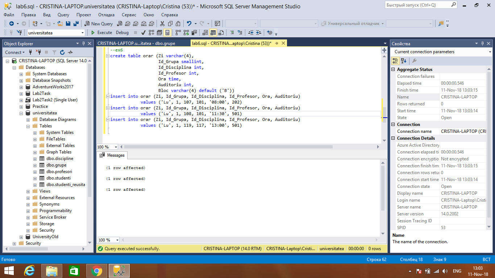
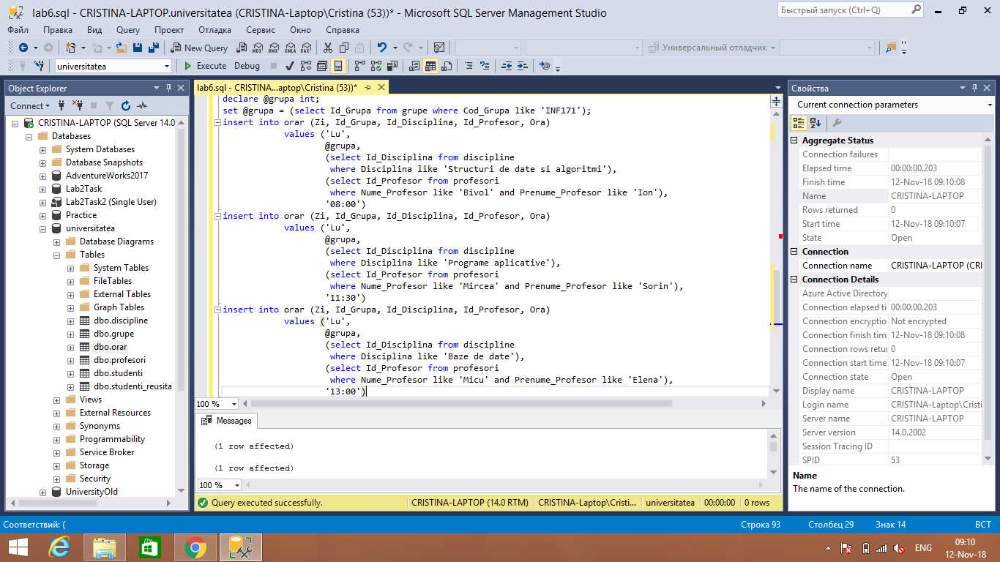

# Database Laboratory Work #6

##Task 1
###_Sa se scrie o instructiune T-SQL, care ar popula coloana Adresa Postala Profesor din tabelul profesori cu valoarea 'mun. Chisinau', unde adresa este necunoscuta._

##Task 2
###_Sa se modifice schema tabelului grupe, ca sa corespunda urmatoarelor cerinte:_
###_a) Campul Cod Grupa sa accepte numai valorile unice si sa nu accepte valori necunoscute._
###_b) Sa se tina cont ca cheia primara, deja, este definita asupra coloanei Id Grupa._ 

##Task 3
###_La tabelul grupe, sa se adauge 2 coloane noi Sef grupa si Prof Indrumator, ambele de tip INT. Si sa se populeze campurile nou-create cu cele mai potrivite candidaturi in baza criteriilor de mai jos:_ 
###_a) Seful grupei trebuie sa aiba cea mai buna reusita (medie) din grupa la toate formele de evaluare si la toate disciplinele. Un student nu poate fi Sef de grupa la mai multe grupe._ 
###_b) Profesorul Indrumator trebuie sa predea un numar maximal posibil de discipline la grupa data. Daca nu exista o singura candidatura, care corespunde primei cerinte, atunci este ales din grupul de candidati acel cu identificatorul (Id Profesor) minimal. Un profesor nu poate fi indrumator la mai multe grupe. 
###_c) Sii se scrie instructiunile ALTER, SELECT, UPDATE necesare pentru crearea coloanelor in tabelul grupe, pentru selectarea candidatilor si inserarea datelor_ 

##Task 4
###_Sa se scrie o instructiune T-SQL, care ar mari toate notele de evaluare sefilor de grupe cu un punct. Nota maximala (10) nu poate fi marita._

##Task 5
###_Sa se creeze un tabel profesori new, care include urmatoarele coloane: Id Profesor, Nume Profesor, Prenume Profesor, Localitate, Adresa1, Adresa2._ 
##Task 6
###_Sa se insereze datele in tabelul orarul pentru Grupa= 'CIB171' (Id Grupa= 1) pentru ziua de luni. Toate lectiile vor avea loc ill blocul de studii 'B'_

##Task 7
###_Sa se scrie expresiile T-SQL necesare pentru a popula tabelul orarul pentru grupa INF171, ziua de luni. Datele necesare pentru inserare trebuie sa fie colectate cu ajutorul instructiunii/instructiunilor SELECT si introduse in tabelul-destinatie_

##Task 8
###_Sa se scrie interogarile de creare a indecsilor asupra tabelelor din baza de date universitatea pentru a asigura o performanta sporita la executarea interogarilor SELECT din Lucrarea practica 4. Rezultatele optimizarii sa fie analizate in baza planurilor de executie, pana la si dupa crearea indecsilor. Indecsii nou-creati sa fie plasati fizic in grupul de fisiere userdatafgroup1_

