# Database Laboratory Work #7

##Task 1
###_Creati o diagrama a bazei de date, folosind fonna de vizualizare standard, structura careia este descrisa la inceputul sarcinilor practice din capitolul 4._

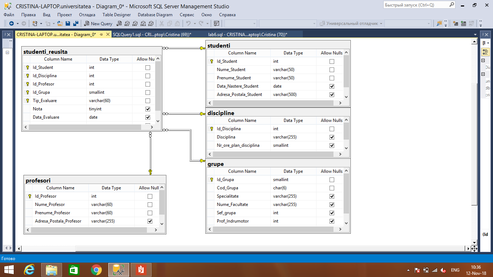
##Task 2
###_Sa se adauge constrangeri referentiale (legate cu tabelele studenti si profesori) necesare coloanelor Sef grupa si Prof Indrumator (sarcina3, capitolul 6) din tabelul grupe._ 
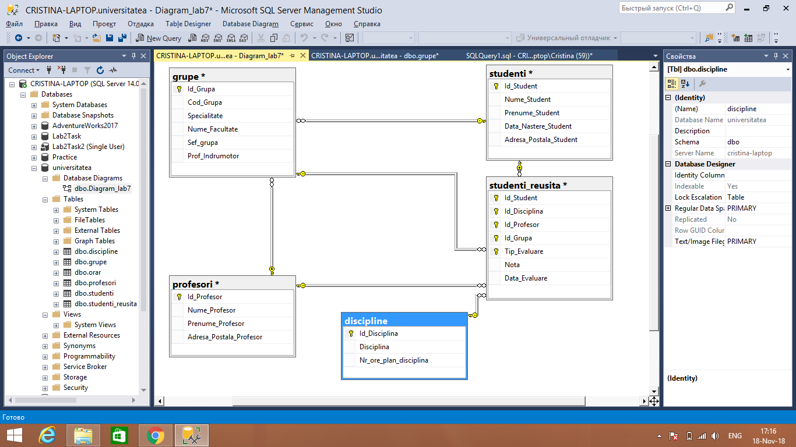
##Task 3
###_La diagrama construita, sa se adauge și tabelul orar definit in capitolul 6 al acestei lucrari: tabelul orarul contine identificatorul disciplinei (Id Disciplina), identificatorul profesorului (Id Profesor) si blocul de studii (Bloc). Cheia tabelului este constituita din trei campuri: identificatorul grupei (Id Grupa), ziua lectiei (Zi), ora de inceput a lectiei (Ora), sala unde are loc lectia (Auditoriu)._ 
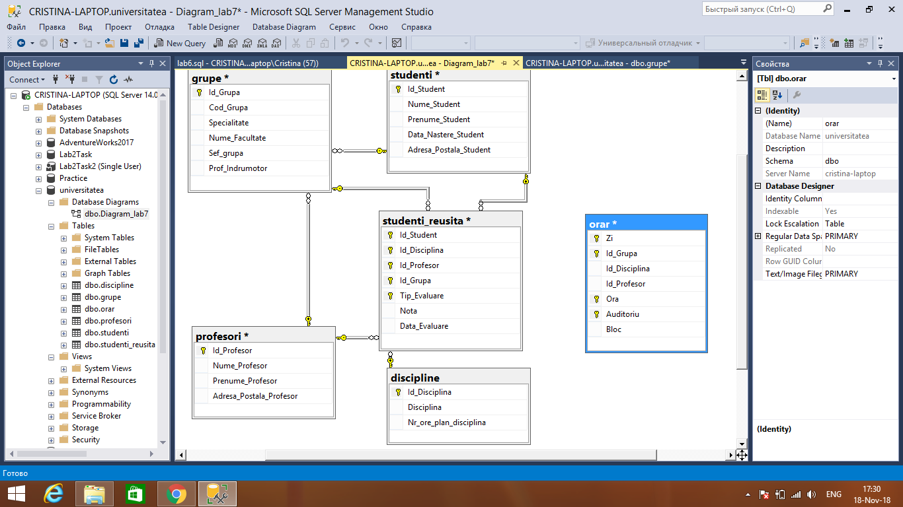
##Task 4
###_Tabelul orarul trebuie sa contina si 2 chei secundare: (Zi, Ora, Id Grupa, Id Profesor) si (Zi, Ora, Id Grupa, Id Disciplina)._
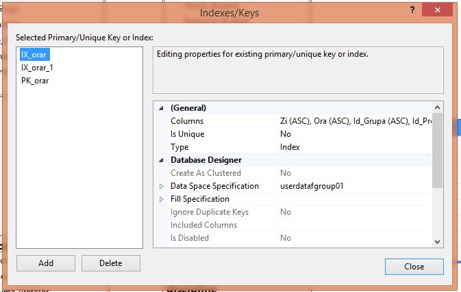
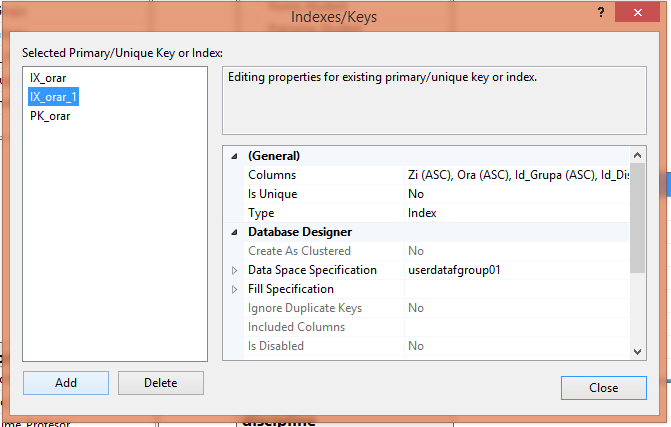
##Task 5
###_In diagrama, de asemenea, trebuie sa se defineasca constrangerile referentiale (FK-PK) ale atributelor Id Disciplina, Id Profesor, Id Grupa din tabelului orarul cu atributele tabelelor respective._ 
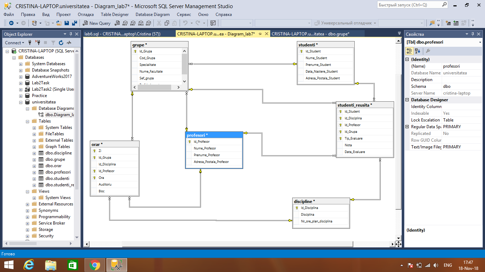
##Task 6
###_Creati, in baza de date universitatea, trei scheme noi: cadre didactice, plan studii si studenti. Transferati tabelul profesori din schema dbo in schema cadre didactice, tinand cont de dependentelor definite asupra tabelului mentionat. In acelasi mod sa se trateze tabelele orarul, discipline care apartin schemei plan studii si tabelele studenti, studenti reusita, care apartin schemei studenti. Se scrie instructiunile SQL respective._
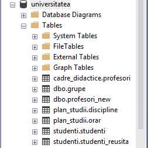
##Task 7
###_Modificati 2-3 interogari asupra bazei de date universitatea prezentate in capitolul 4 astfel ca numele tabelelor accesate sa fie descrise in mod explicit, tinand cont de faptul ca tabelele au fost mutate in scheme noi._
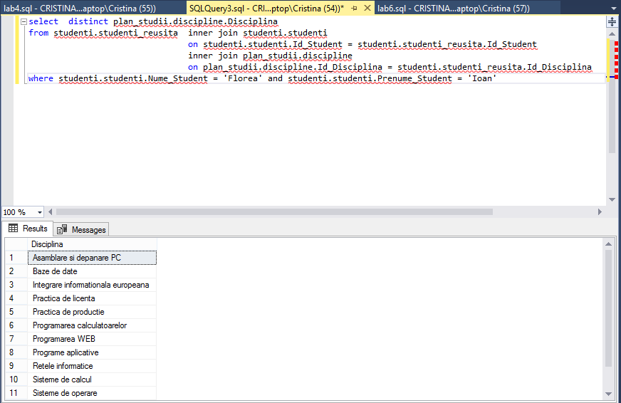
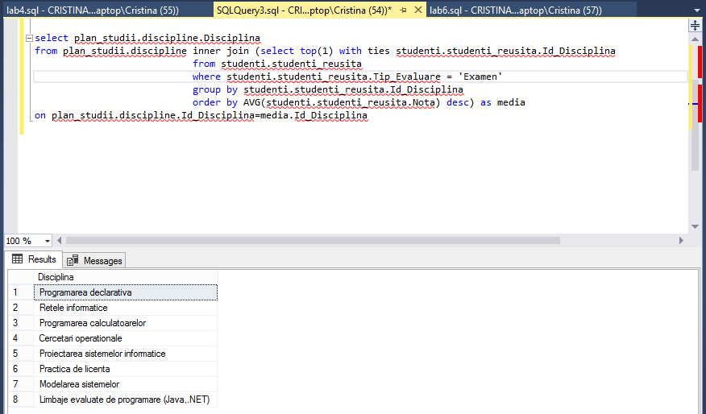
##Task 8
###_Creati sinonimele respective pentru a simplifica interogarile construite in exercitiul precedent ~i reformulati interogarile, folosind sinonimele create._
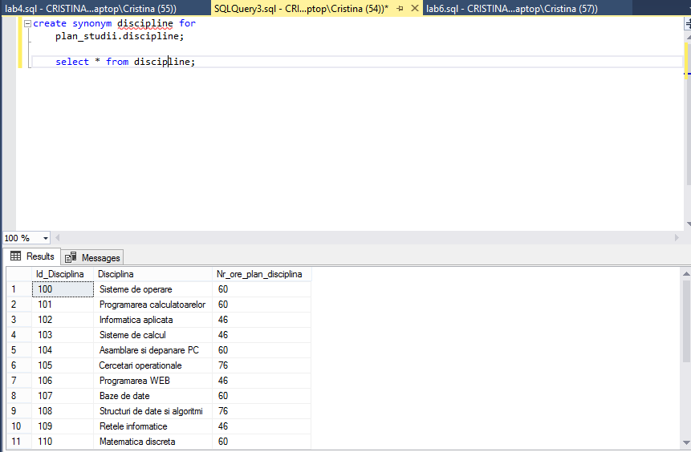
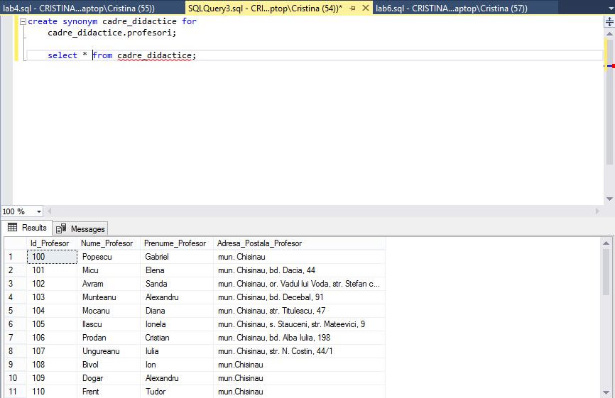

