# Database Laboratory Work #8

##Task 1
###_Sa se creeze doua viziuni in baza interogarilor formulate in doua exercitii indicate din capitolul 4. Prima viziune sa fie construita in Editorul de interogari, iar a doua, utilizand View Designer._

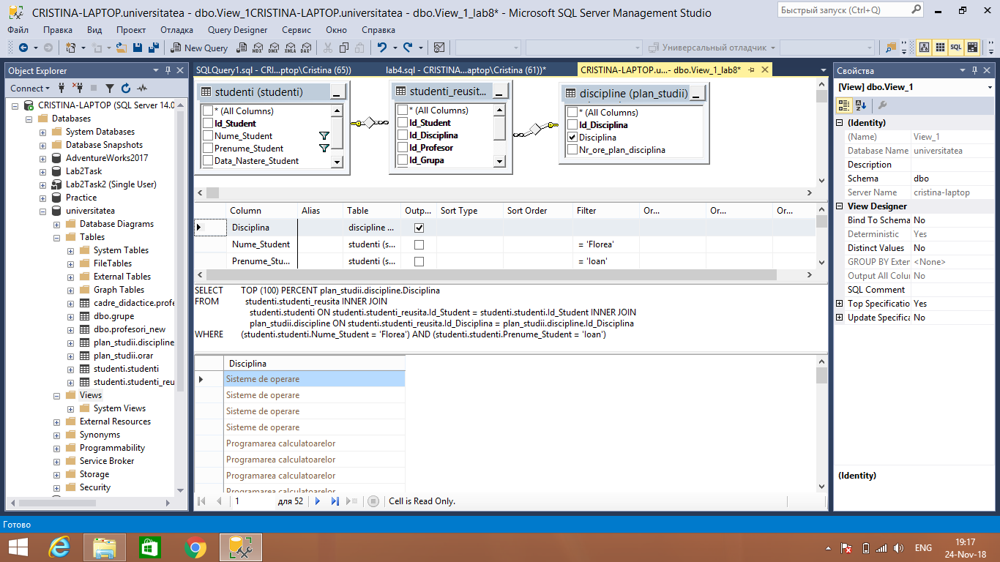
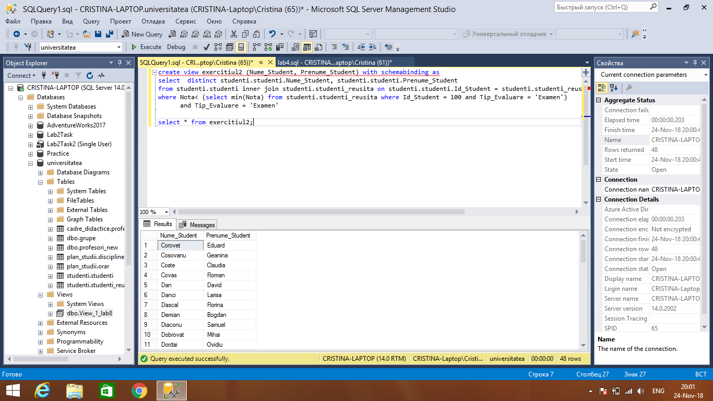
##Task 2
###_Sa se scrie cate un exemplu de instructiuni INSERT, UPDATE, DELETE asupra viziunilor create. Sa se adauge comentariile respective referitoare la rezultatele executarii acestor instructiuni._ 
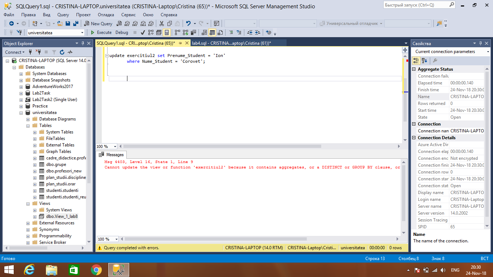
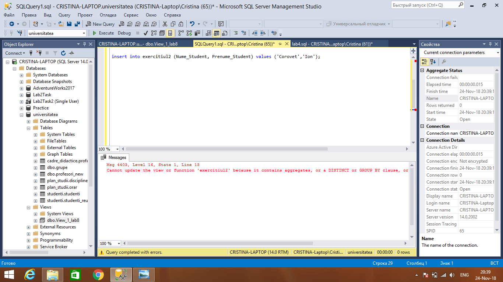
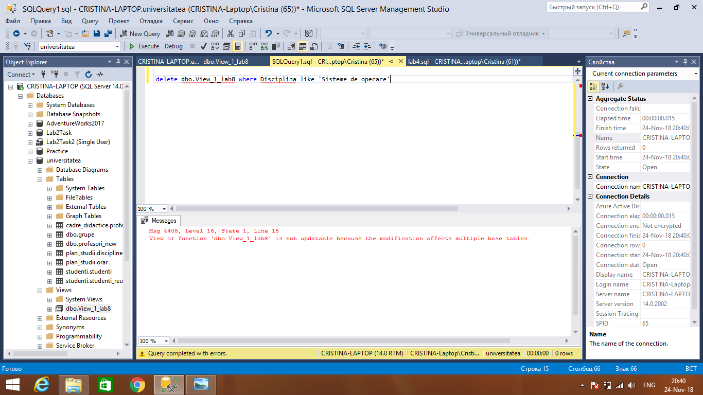
###Instructiunile date nu au putut fi executate din cauza ca interogarile nu au fost efectuate asupra unui tabel, dar si restrictii precum: expresia inner join, clauza distinct si functia de agregare MIN 
##Task 3
###_Sa se scrie instructiunile SQL care ar modifica viziunile create (in exercitiul 1) in asa fel, incat sa nu fie posibila modificarea sau stergerea tabelelor pe care acestea sunt definite si viziunile sa nu accepte operatiuni DML, daca conditiile clauzei WHERE nu sunt satisfacute._ 
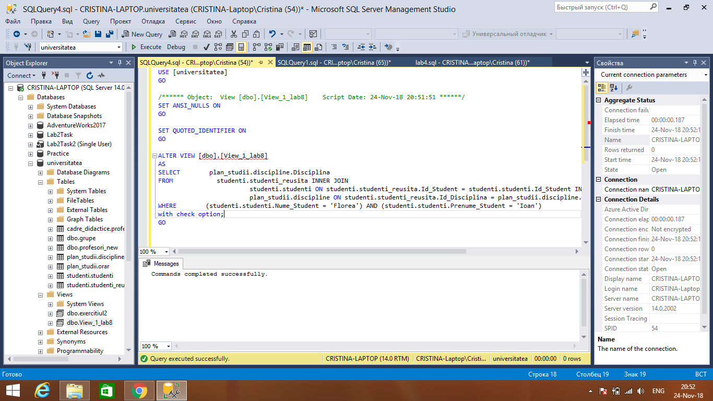
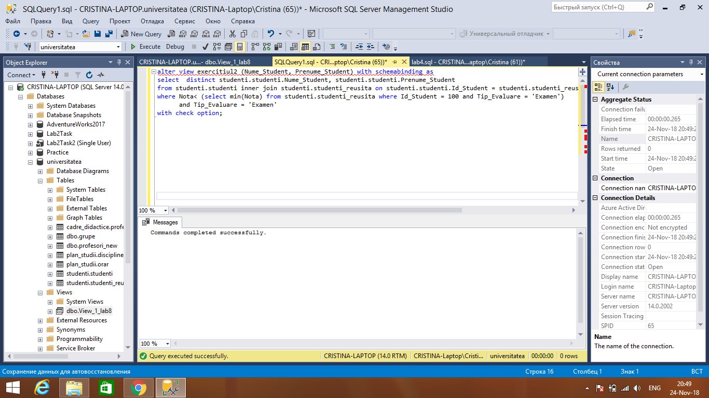
##Task 4
###_Sa se scrie instructiunile de testare a proprietatilor noi definite._
###Pentru ca instructiunile nu pot fi efectuate nici in exercitiul2, a fost creata o noua viziune asupra altui exercitiu din laboratorul4 si verificate instructiunile asupra acestei viziuni
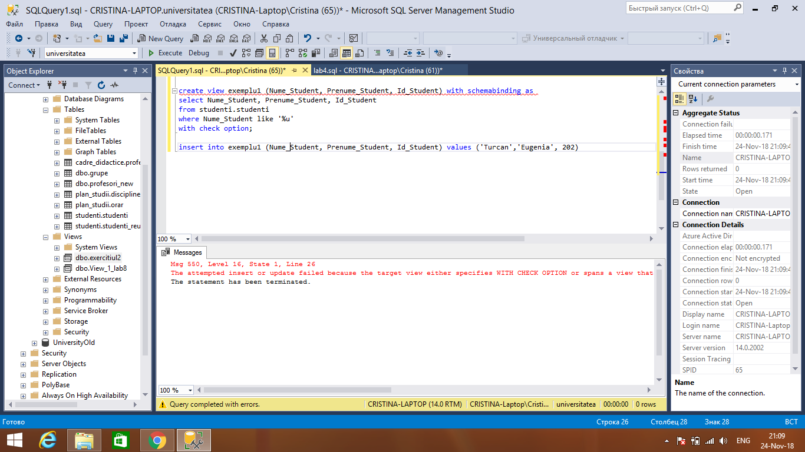
##Task 5
###_Sa se rescrie 2 interogari formulate in exercitiile din capitolul 4, in asa fel. incat interogarile imbricate sa fie redate sub forma expresiilor CTE._ 
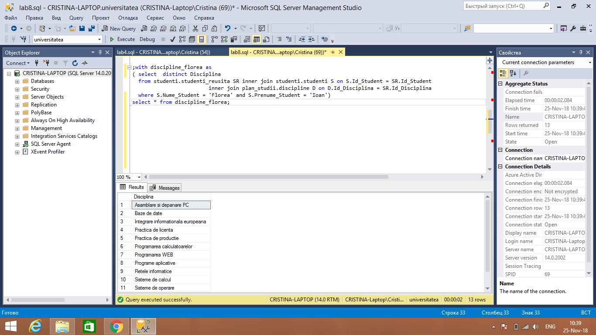
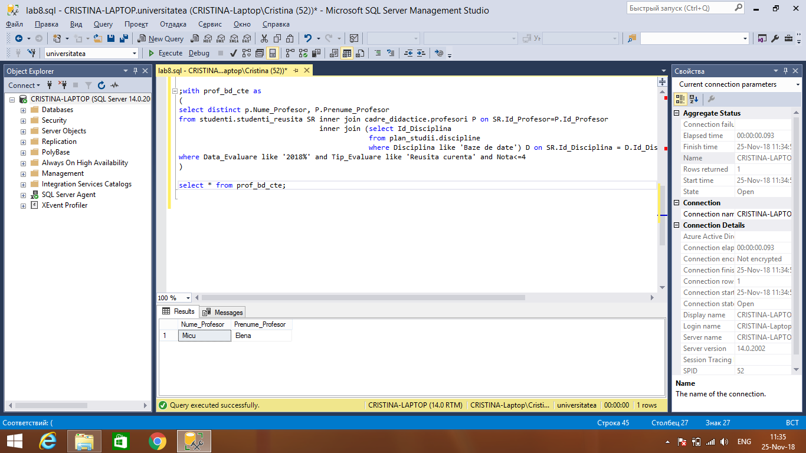
##Task 6
###_Se considera un graf orientat, precum cel din figura de mai jos si fie se doreste parcursa calea de la nodul id = 3 la nodul unde id = 0. Sa se faca reprezentarea grafului orientat in forma de expresie-tabel recursiv. Sa se observe instructiunea de dupa UNION ALL a membrului recursiv, precum si partea de pana la UNION ALL reprezentata de membrul-ancora._
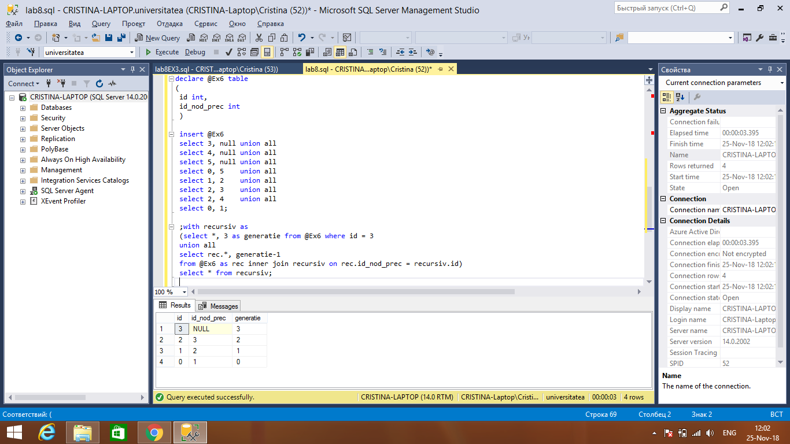
